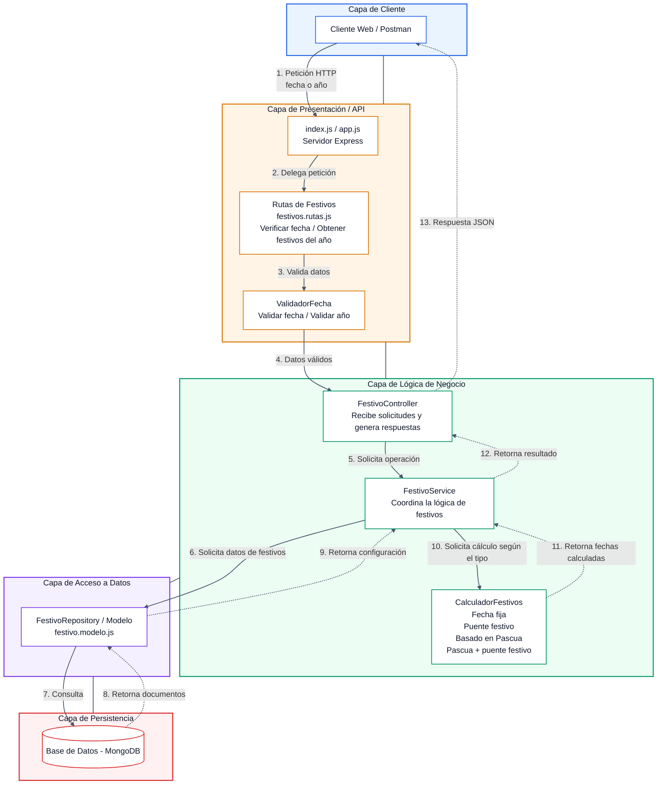

# Diagrama de Arquitectura - API Festivos

```mermaid
flowchart TD

    %% =========================
    %% CAPA DE CLIENTE
    %% =========================
    subgraph ClientLayer["Capa de Cliente"]
        direction TB
        Client["Cliente Web / Postman"]
    end

    %% =========================
    %% CAPA DE PRESENTACIÓN / API
    %% =========================
    subgraph PresentationLayer["Capa de Presentación / API"]
        direction TB

        App["index.js / app.js<br/>Servidor Express"]

        Routes["Rutas de Festivos<br/>festivos.rutas.js<br/>Verificar fecha / Obtener festivos del año"]

        Validator["ValidadorFecha<br/>Validar fecha / Validar año"]
    end

    %% =========================
    %% CAPA DE LÓGICA DE NEGOCIO
    %% =========================
    subgraph BusinessLayer["Capa de Lógica de Negocio"]
        direction TB

        Controller["FestivoController<br/>Recibe solicitudes y genera respuestas"]

        Service["FestivoService<br/>Coordina la lógica de festivos"]

        Calculator["CalculadorFestivos<br/>Fecha fija<br/>Puente festivo<br/>Basado en Pascua<br/>Pascua + puente festivo"]
    end

    %% =========================
    %% CAPA DE ACCESO A DATOS
    %% =========================
    subgraph DataAccessLayer["Capa de Acceso a Datos"]
        direction TB

        Repository["FestivoRepository / Modelo<br/>festivo.modelo.js"]
    end

    %% =========================
    %% CAPA DE PERSISTENCIA
    %% =========================
    subgraph PersistenceLayer["Capa de Persistencia"]
        direction TB

        DB[("Base de Datos - MongoDB")]
    end

    %% =========================
    %% FLUJO DE LA PETICIÓN
    %% =========================
    Client -->|"1. Petición HTTP<br/>fecha o año"| App

    App -->|"2. Delega petición"| Routes

    Routes -->|"3. Valida datos"| Validator

    Validator -->|"4. Datos válidos"| Controller

    Controller -->|"5. Solicita operación"| Service

    %% =========================
    %% CONSULTA DE CONFIGURACIÓN
    %% =========================
    Service -->|"6. Solicita datos de festivos"| Repository

    Repository -->|"7. Consulta"| DB

    DB -.->|"8. Retorna documentos"| Repository

    Repository -.->|"9. Retorna configuración"| Service

    %% =========================
    %% CÁLCULO DE FESTIVOS
    %% =========================
    Service -->|"10. Solicita cálculo según el tipo"| Calculator

    Calculator -.->|"11. Retorna fechas calculadas"| Service

    %% =========================
    %% RESPUESTA
    %% =========================
    Service -.->|"12. Retorna resultado"| Controller

    Controller -.->|"13. Respuesta JSON"| Client

    %% =========================
    %% ORDEN VISUAL DE LAS CAPAS
    %% =========================
    ClientLayer ~~~ PresentationLayer
    PresentationLayer ~~~ BusinessLayer
    BusinessLayer ~~~ DataAccessLayer
    DataAccessLayer ~~~ PersistenceLayer

    %% =========================
    %% ESTILO GENERAL DE NODOS
    %% =========================
    classDef default fill:#FFFFFF,stroke:#334155,stroke-width:1.5px,color:#0F172A

    %% =========================
    %% ESTILOS DE LAS CAPAS
    %% =========================
    style ClientLayer fill:#EAF4FF,stroke:#2563EB,stroke-width:2px,color:#0F172A

    style PresentationLayer fill:#FFF4E5,stroke:#D97706,stroke-width:2px,color:#0F172A

    style BusinessLayer fill:#ECFDF3,stroke:#059669,stroke-width:2px,color:#0F172A

    style DataAccessLayer fill:#F5F0FF,stroke:#7C3AED,stroke-width:2px,color:#0F172A

    style PersistenceLayer fill:#FFF1F2,stroke:#DC2626,stroke-width:2px,color:#0F172A

    %% =========================
    %% ESTILOS DE LOS NODOS
    %% =========================
    style Client fill:#FFFFFF,stroke:#2563EB,stroke-width:1.5px,color:#0F172A

    style App fill:#FFFFFF,stroke:#D97706,stroke-width:1.5px,color:#0F172A

    style Routes fill:#FFFFFF,stroke:#D97706,stroke-width:1.5px,color:#0F172A

    style Validator fill:#FFFFFF,stroke:#D97706,stroke-width:1.5px,color:#0F172A

    style Controller fill:#FFFFFF,stroke:#059669,stroke-width:1.5px,color:#0F172A

    style Service fill:#FFFFFF,stroke:#059669,stroke-width:1.5px,color:#0F172A

    style Calculator fill:#FFFFFF,stroke:#059669,stroke-width:1.5px,color:#0F172A

    style Repository fill:#FFFFFF,stroke:#7C3AED,stroke-width:1.5px,color:#0F172A

    style DB fill:#FFFFFF,stroke:#DC2626,stroke-width:1.5px,color:#0F172A

    %% =========================
    %% COLOR DE LAS CONEXIONES
    %% =========================
    linkStyle default stroke:#475569,stroke-width:1.5px
```