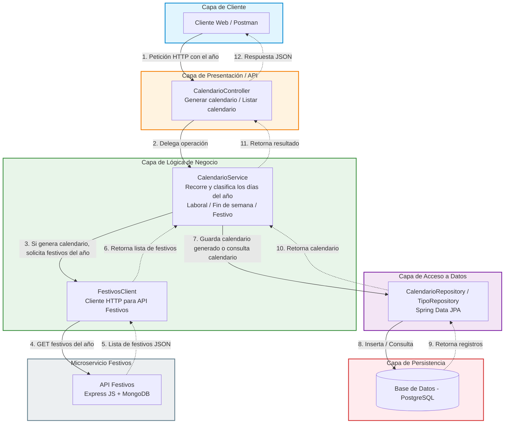

# Diagrama de Arquitectura - API Calendario

```mermaid
graph TD

    %% =========================
    %% CAPA DE CLIENTE
    %% =========================
    subgraph ClientLayer["Capa de Cliente"]
        direction TB

        Client["Cliente Web / Postman"]

    end

    %% =========================
    %% CAPA DE PRESENTACIÓN
    %% =========================
    subgraph PresentationLayer["Capa de Presentación / API"]
        direction TB

        Controller["CalendarioController<br/>Generar calendario / Listar calendario"]

    end

    %% =========================
    %% CAPA DE LÓGICA DE NEGOCIO
    %% =========================
    subgraph BusinessLayer["Capa de Lógica de Negocio"]
        direction LR

        Service["CalendarioService<br/>Recorre y clasifica los días del año<br/>Laboral / Fin de semana / Festivo"]

        FestivosClient["FestivosClient<br/>Cliente HTTP para API Festivos"]

        Service -->|"3. Si genera calendario, solicita festivos del año"| FestivosClient

        FestivosClient -.->|"6. Retorna lista de festivos"| Service

    end

    %% =========================
    %% CAPA DE ACCESO A DATOS
    %% =========================
    subgraph DataAccessLayer["Capa de Acceso a Datos"]
        direction TB

        Repository["CalendarioRepository / TipoRepository<br/>Spring Data JPA"]

    end

    %% =========================
    %% CAPA DE PERSISTENCIA
    %% =========================
    subgraph PersistenceLayer["Capa de Persistencia"]
        direction TB

        DB[("Base de Datos - PostgreSQL")]

    end

    %% =========================
    %% MICROSERVICIO FESTIVOS
    %% =========================
    subgraph FestivosAPI["Microservicio Festivos"]
        direction TB

        ExternalAPI["API Festivos<br/>Express JS + MongoDB"]

    end

    %% =========================
    %% FLUJO PRINCIPAL
    %% =========================
    Client -->|"1. Petición HTTP con el año"| Controller

    Controller -->|"2. Delega operación"| Service

    FestivosClient -->|"4. GET festivos del año"| ExternalAPI

    ExternalAPI -.->|"5. Lista de festivos JSON"| FestivosClient

    Service -->|"7. Guarda calendario generado o consulta calendario"| Repository

    Repository -->|"8. Inserta / Consulta"| DB

    %% =========================
    %% FLUJO DE RETORNO
    %% =========================
    DB -.->|"9. Retorna registros"| Repository

    Repository -.->|"10. Retorna calendario"| Service

    Service -.->|"11. Retorna resultado"| Controller

    Controller -.->|"12. Respuesta JSON"| Client

    %% =========================
    %% ORDEN VISUAL DE LAS CAPAS
    %% =========================
    ClientLayer ~~~ PresentationLayer

    PresentationLayer ~~~ BusinessLayer

    BusinessLayer ~~~ DataAccessLayer

    DataAccessLayer ~~~ PersistenceLayer

    %% =========================
    %% ESTILOS
    %% =========================
    style ClientLayer fill:#e1f5fe,stroke:#0288d1,stroke-width:2px

    style PresentationLayer fill:#fff3e0,stroke:#f57c00,stroke-width:2px

    style BusinessLayer fill:#e8f5e9,stroke:#388e3c,stroke-width:2px

    style DataAccessLayer fill:#f3e5f5,stroke:#7b1fa2,stroke-width:2px

    style PersistenceLayer fill:#ffebee,stroke:#d32f2f,stroke-width:2px

    style FestivosAPI fill:#eceff1,stroke:#607d8b,stroke-width:2px
```