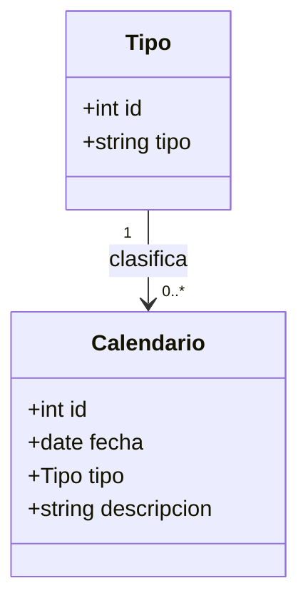

# Modelo Objetual - API Calendario

```mermaid
classDiagram
direction TB

class Tipo {
    +int id
    +string tipo
}

class Calendario {
    +int id
    +date fecha
    +Tipo tipo
    +string descripcion
}

Tipo "1" --> "0..*" Calendario : clasifica
```