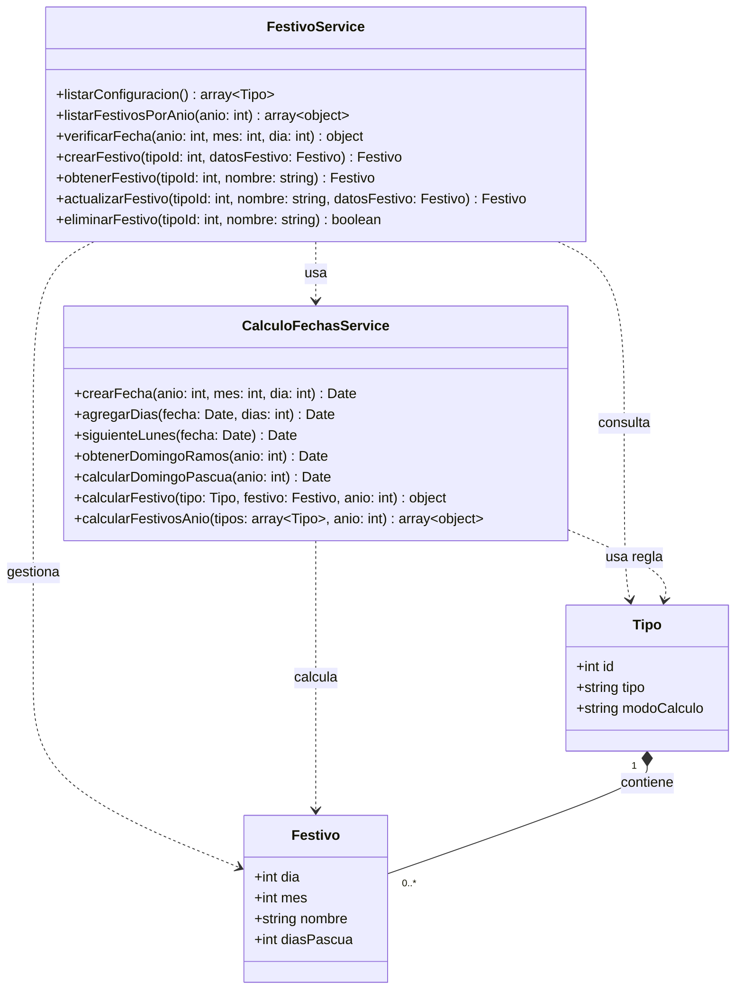

# Modelo Objetual - API Festivos

```mermaid
classDiagram
direction TB

class FestivoService {
    +listarConfiguracion() array~Tipo~
    +listarFestivosPorAnio(anio: int) array~object~
    +verificarFecha(anio: int, mes: int, dia: int) object
    +crearFestivo(tipoId: int, datosFestivo: Festivo) Festivo
    +obtenerFestivo(tipoId: int, nombre: string) Festivo
    +actualizarFestivo(tipoId: int, nombre: string, datosFestivo: Festivo) Festivo
    +eliminarFestivo(tipoId: int, nombre: string) boolean
}

class CalculoFechasService {
    +crearFecha(anio: int, mes: int, dia: int) Date
    +agregarDias(fecha: Date, dias: int) Date
    +siguienteLunes(fecha: Date) Date
    +obtenerDomingoRamos(anio: int) Date
    +calcularDomingoPascua(anio: int) Date
    +calcularFestivo(tipo: Tipo, festivo: Festivo, anio: int) object
    +calcularFestivosAnio(tipos: array~Tipo~, anio: int) array~object~
}

class Tipo {
    +int id
    +string tipo
    +string modoCalculo
}

class Festivo {
    +int dia
    +int mes
    +string nombre
    +int diasPascua
}

FestivoService ..> Tipo : consulta
FestivoService ..> Festivo : gestiona
FestivoService ..> CalculoFechasService : usa

CalculoFechasService ..> Tipo : usa regla
CalculoFechasService ..> Festivo : calcula

Tipo "1" *-- "0..*" Festivo : contiene
```