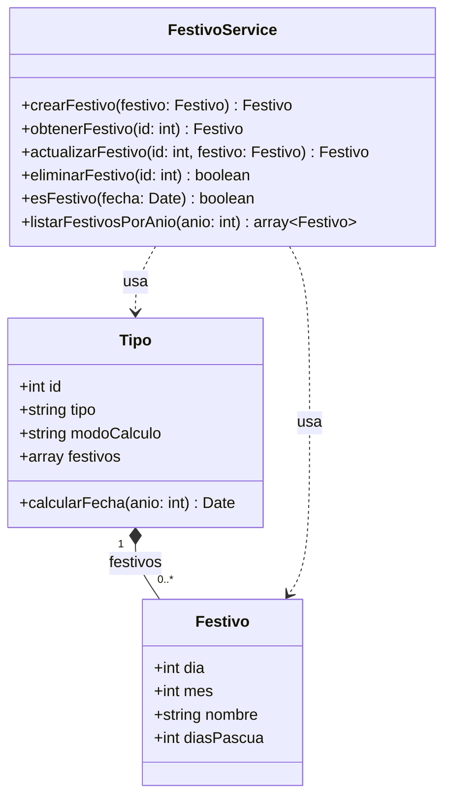

# Modelo Objetual - API Festivos

```mermaid
classDiagram
direction TB

class Tipo {
    +int id
    +string tipo
    +string modoCalculo
    +array festivos
    +calcularFecha(anio: int) Date
}

class Festivo {
    +int dia
    +int mes
    +string nombre
    +int diasPascua
}

class FestivoService {
    +crearFestivo(festivo: Festivo) Festivo
    +obtenerFestivo(id: int) Festivo
    +actualizarFestivo(id: int, festivo: Festivo) Festivo
    +eliminarFestivo(id: int) boolean
    +esFestivo(fecha: Date) boolean
    +listarFestivosPorAnio(anio: int) array~Festivo~
}

Tipo "1" *-- "0..*" Festivo : festivos
FestivoService ..> Tipo : usa
FestivoService ..> Festivo : usa
```