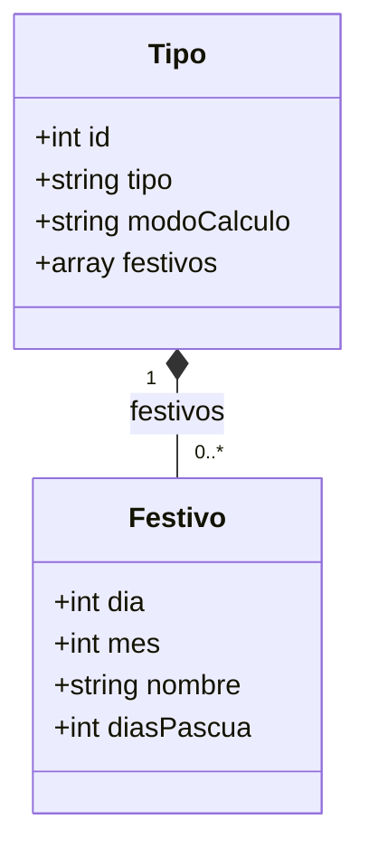

# Modelo Objetual - API Festivos

```mermaid
classDiagram
direction TB

class Tipo {
    +int id
    +string tipo
    +string modoCalculo
    +array festivos
}

class Festivo {
    +int dia
    +int mes
    +string nombre
    +int diasPascua
}

Tipo "1" *-- "0..*" Festivo : festivos
```